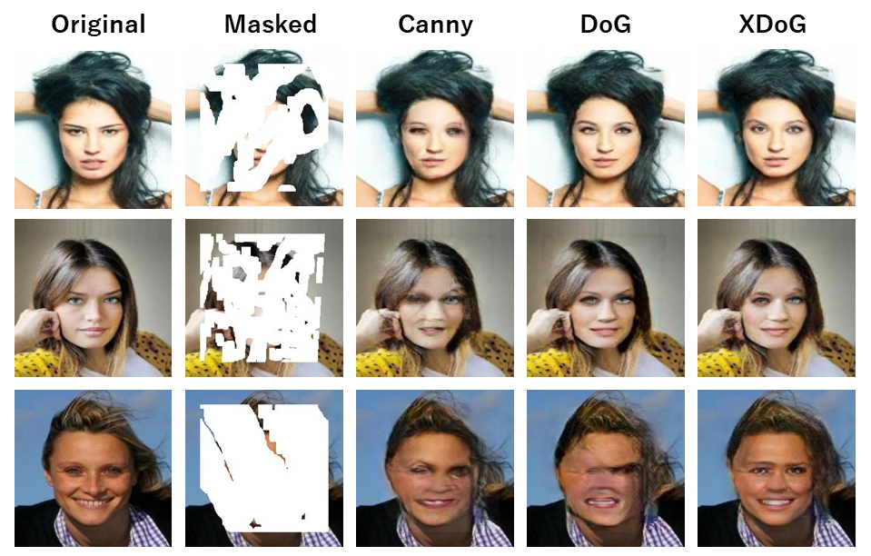

# エッジを用いたInpainting
[EdgeConnect](https://github.com/knazeri/edge-connect)では、CannyエッジをInpaintingに導入しています。ここでは、Cannyの代わりにDoGとXDoGを導入することで精度を向上させました。さらに、データの前処理、評価手法、デモ用コードが追加され、より多機能にしてあります。

<p align='center'>  
   <br>
  各エッジにおける生成画像 (CelebA)
</p>

# 環境構築
以下の環境が必要です。最新のバージョンでもコードの一部を修正すれば使用できます。
* python 3
* pytorch 1.2

パッケージをインストールしてください。
```
pip install -r requirements.txt
```

## 学習済モデル
以下のリンクから学習済モデルをダウンロードできます。
* [CelebA](https://drive.google.com/drive/folders/1yJDq7rMEaRu9azCyTUO6h_OMSGVvqJWz?usp=sharing)
* [Paris Street View](https://drive.google.com/drive/folders/1GI8euk0mk-4tGPW7OYLO7CS46PY4BHGf?usp=sharing)
* [ガンマ補正](https://drive.google.com/drive/folders/1qcZ5DRLhB7cOnO4-KTWawoBuNQdTeCds?usp=sharing)

これらの学習済みモデルは、checkpointsディレクトリに展開することを推奨します。

## データセット
### 1) 画像
以下のリンクからデータセットがダウンロードできます。
* [CelebA](http://mmlab.ie.cuhk.edu.hk/projects/CelebA.html) 
* [Paris Street View](https://github.com/pathak22/context-encoder)

ただし、Paris Street Viewは、著者にメールで問い合わせる必要があります。

datasetsディレクトリ上で解凍してください。unzipコマンドが使用できない環境の場合、pythonファイルで代用できます。
```
mkdir datasets
python unzip.py --path dataset-path --dir unzip-path
```
解凍後は、以下のコードを実行して、学習・評価・テストに分割してください。
### CelebA
```
mkdir datasets/celebA
python resize.py --path ./datasets/img_align_celeba --outpath ./datasets/celebA/resize --datasets paris
python SplitImage.py --path ./datasets/celebA --num_train 10000 --num_val 1000 --num_test 1000  --datasets celebA
```
### Paris Street View
```
mkdir datasets/paris
python resize.py --path ./datasets/paris_train_original --outpath ./datasets/paris/resize --datasets paris
python SplitImage.py --path ./datasets/paris --num_train 10000 --num_val 1000 --num_test 1000 --datasets paris
```

データセットの分割が終わったら、flistを作成してください。
```
python ./scripts/flist.py --path ./datasets/celebA/train --output ./datasets/celebA/celebA_train.flist
python ./scripts/flist.py --path ./datasets/celebA/test --output ./datasets/celebA/celebA_test.flist
python ./scripts/flist.py --path ./datasets/celebA/valid --output ./datasets/celebA/celebA_valid.flist
```

### 2) マスク画像
マスク画像は、[Liu et al.](https://arxiv.org/abs/1804.07723)が提供しているものを使用しました。以下のリンクから**Testing Set**をダウンロードしてください。
* [website](https://nv-adlr.github.io/publication/partialconv-inpainting).

同様に画像の前処理をしてください。
```
mkdir datasets/masks
python resize.py --path ./datasets/mask/testing_mask_dataset --outpath ./datasets/masks/resize --datasets mask
python SplitImage.py --path ./datasets/masks/resize --num_train 10000 --num_val 1000 --num_test 1000 --datasets mask
```
```
python ./scripts/flist.py --path ./datasets/masks/train --output ./datasets/masks/masks_train.flist
python ./scripts/flist.py --path ./datasets/masks/test --output ./datasets/masks/masks_test.flist
python ./scripts/flist.py --path ./datasets/masks/valid --output ./datasets/masks/masks_valid.flist
```

# 学習
モデルの保存先とconfig.ymlを作成してください。必要に応じて、ymlのパスなどを変更してください。
```
mkdir checkpoints
mkdir ./checkpoints/celebA
cp ./config.yml.example ./checkpoints/celebA/config.yml
```

学習は、3ステージ(1: edge model, 2: inpaint model, 3: joint model)をする必要があります。1と2は独立しているので、別々のGPUで同時に学習しても大丈夫です。
```
python train.py --model 1 --checkpoints ./checkpoints/celebA
```

# テスト
以下のコマンドで、マスクごとの結果を出力します。
```
mkdir results
python test.py \
  --checkpoints ./checkpoints/celebA
  --input ./examples/celebA/images 
  --mask ./examples/celebA/masks
  --output ./results/celebA
```

# 評価
評価手法は、PSNR、SSIM、FID、LPIPSの4つが用意されています。
以下のコードで、マスクサイズごとのPSNRとSSIMを求めます。
```
python ./scripts/metrics.py --data-path ./results/celebA/val --output-path ./results/celebA
```
LPIPSは、ライブラリをインストールしてください。
```
pip install lpips
python ./scripts/lpips_score.py --data-path ./results/celebA --output-path ./results/celebA/val
```
FIDは以下の通りです。
```
python ./scripts/fid_score.py --path ./results/celebA, ./results/celebA/val --gpu 0
```

# 学習の設定
コードと設定ファイル(yml)は、ベースモデルと同じです。
詳しくは[公式](https://github.com/knazeri/edge-connect)を参考にしてください。
追記した設定は以下の通りです。

Option          | Description
----------------| -----------
EDGE            | 1: canny, 2: DoG, 3: XDoG, 4: external
CORRECT         | 0: no gamma correction, 1: gamma correction

# デモアプリ
[デモアプリ](https://github.com/Kohey1480/inpaint-app)の一部を変更して使用しています。
画像は、256*256にリサイズしてから入力してください。
```
pip install flask
python app.py
```


# 参考文献
* https://github.com/knazeri/edge-connect
* https://github.com/Kohey1480/inpaint-app
